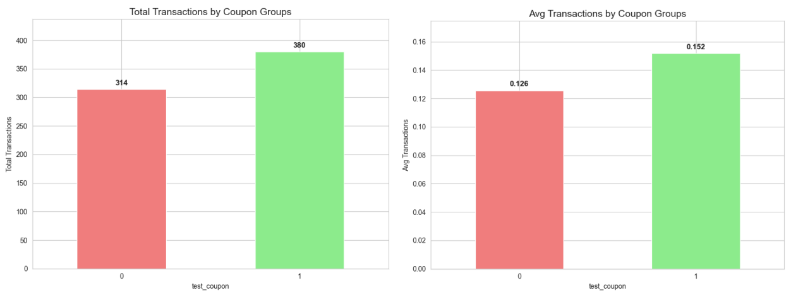
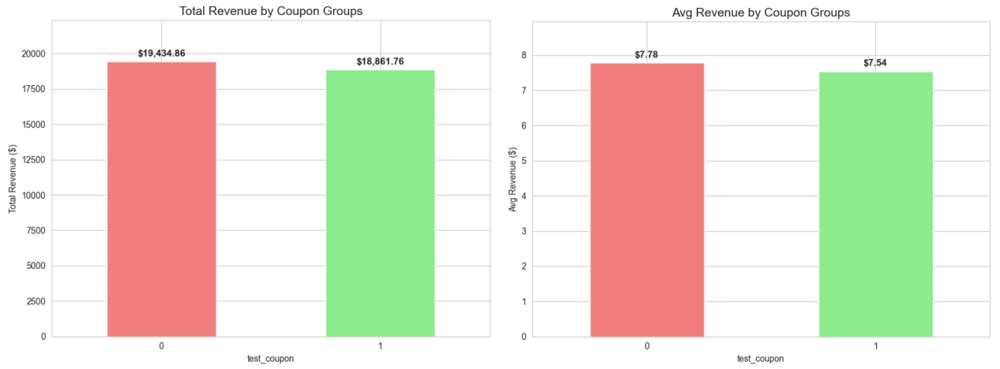
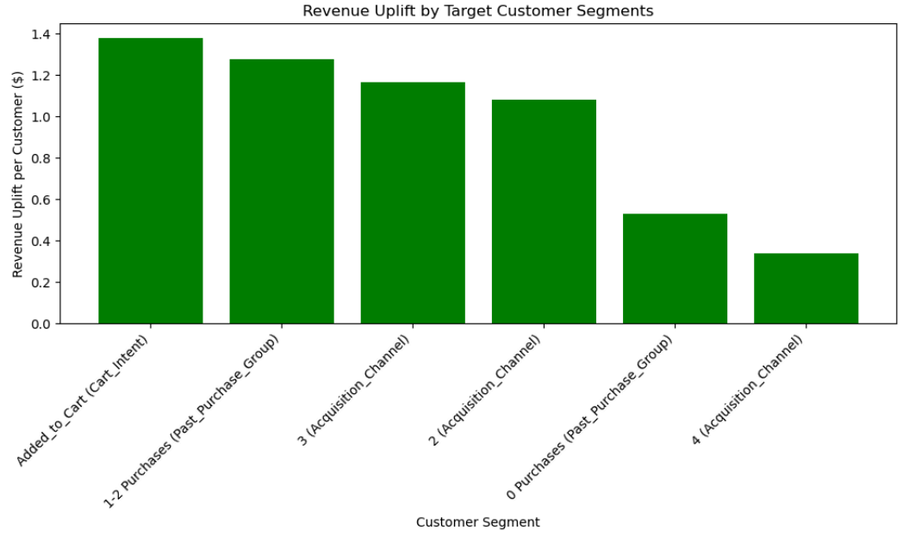
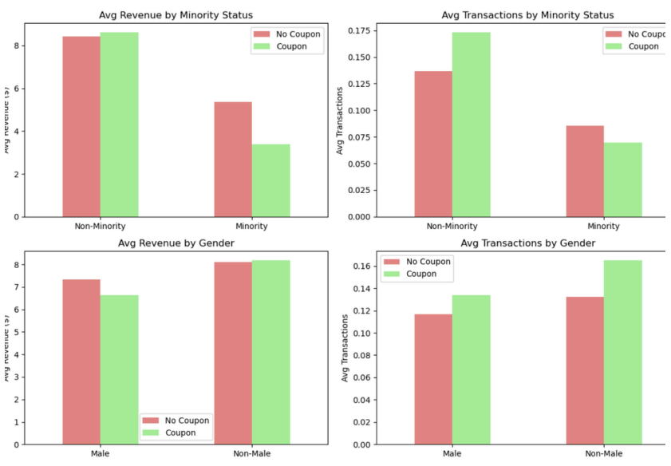
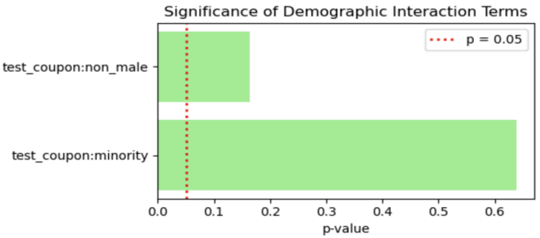
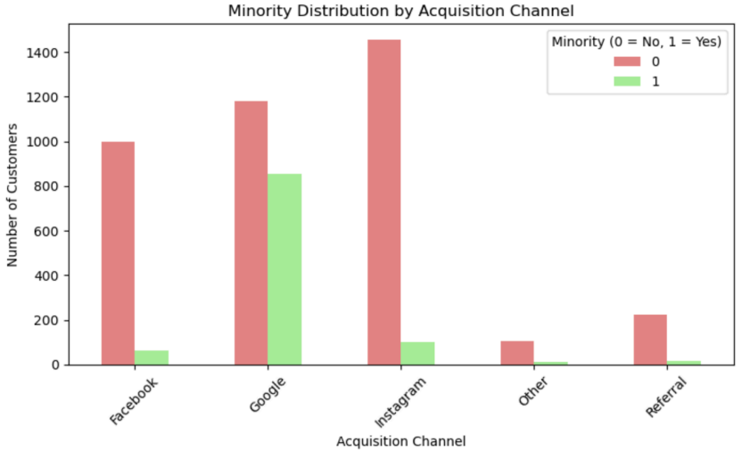

# Artea A/B Test & Causal Targeting Analysis


## 📌 Project Purpose

The project aims to solve Artea's low conversion rate (87% of visitors never buy) by using an A/B test and causal analysis to identify which customer segments actually respond to discount coupons, then designing a targeting rule that lifts revenue while avoiding wasted discounts on customers who would have bought anyway. The analysis also assesses whether demographic data should factor into the strategy.


## 📊 Dataset Description

The analysis uses two main datasets from a randomized A/B experiment, plus a demographic add-on supplied by a third-party data vendor (Trackify).

### `AB_Test` — 5,000 users (the experiment)

Users who had visited the website in the past two months but hadn't purchased. Half were randomly assigned a 20% off coupon, half got nothing.

| Variable | Description |
|---|---|
| `test_coupon` | 1 = received coupon, 0 = control |
| `trans_after` | Transactions made in the month after the experiment |
| `revenue_after` | Total revenue after the experiment (USD) |
| `shopping_cart` | Added to cart in last visit but didn't buy (1/0) |
| `num_past_purch` | Number of previous purchases |
| `spent_last_purchase` | USD spent on previous purchase |
| `weeks_since_visit` | Weeks since last website visit |
| `browsing_minutes` | Minutes on site during last visit |
| `channel_acq` | 1=Google · 2=Facebook · 3=Instagram · 4=Referral · 5=Other |

### `Next_Campaign` — 6,000 users (the future pool)

Same features as above (minus the experiment outcome and treatment columns). This is the pool we apply our targeting rule to.

### Demographic add-on (Part B)

A third-party vendor supplied predicted demographic attributes for both datasets:

| Variable | Description |
|---|---|
| `minority` | Predicted minority group membership (1/0) |
| `non_male` | Predicted non-male gender (1/0) |

These are predicted by an algorithm, not self-reported — an important caveat for both accuracy and ethics.


## 🏷 Methodology

### Step 1: EDA Analysis

Started with group means and two-sample t-tests on `trans_after` and `revenue_after` to check whether the coupon had any overall effect.

### Step 2: OLS regression

Ran an OLS regression of revenue on customer features **plus interaction terms** between `test_coupon` and each feature:

```text
revenue_after ~ test_coupon + shopping_cart + weeks_since_visit
              + browsing_minutes + num_past_purch + spent_last_purchase
              + C(channel_acq)
              + test_coupon:shopping_cart + test_coupon:weeks_since_visit
              + test_coupon:browsing_minutes + test_coupon:num_past_purch
              + test_coupon:spent_last_purchase + test_coupon:C(channel_acq)
```

The interaction terms tell us *which customer traits amplify or shrink the coupon's effect* — this is the heart of the targeting question.

### Step 3: Uplift Analysis

For each segment defined by a significant interaction (cart status, purchase history bin, acquisition channel), compute the uplift and then build the targeting rule.

> **Uplift = Avg(Treatment) − Avg(Control)** — calculated for both transactions and revenue.

### Step 4: Apply the rule to `Next_Campaign`

Identified which of the 6,000 future-campaign users met the targeting criteria, then estimated incremental transactions and revenue using the uplift values from the AB test.

### Step 5: Test demographics separately

Re-ran the regression with `test_coupon:minority` and `test_coupon:non_male` interaction terms added, to check whether the targeting strategy should change based on demographic group.


## 🔍 Key Findings & Insights

### ❶ The blanket coupon backfires on revenue

| Metric | Control | Coupon | Difference | p-value |
|---|---|---|---|---|
| Avg transactions | 0.126 | 0.152 | **+0.026 (+20.8%)** | 0.027 ✅ |
| Avg revenue | $7.78 | $7.54 | **−$0.24** | 0.718 ❌ |

The coupon clearly drove **more purchases**, but the 20% discount reduced the average revenue per purchase, so total revenue actually fell slightly (though the difference isn't statistically significant in either direction). Sending coupons to everyone risks eroding margins without a clear revenue gain.

### ❷ Three interactions reveal where the coupon actually pays off

From the OLS regression:

| Interaction | Coef. | p-value | What it means |
|---|---|---|---|
| `test_coupon × shopping_cart` | +7.69 | 0.021 | Cart-abandoners convert when nudged |
| `test_coupon × num_past_purch` | −1.27 | 0.000 | Loyal customers would buy anyway — discount just destroys margin |
| `test_coupon × Instagram channel` | +3.11 | 0.033 | Instagram-acquired users are more promotion-responsive |

### ❸ The targeting rule

> **Send coupons only to users who: added something to cart, have 0–2 past purchases, AND were acquired through Facebook, Instagram, or Referral.**

### ❹ Expected impact on the next campaign (6,000 users)

| Metric | Value |
|---|---|
| Customers targeted | 668 (11.13% of pool) |
| Incremental transactions | ~51 |
| Incremental revenue | **+$922.51** |
| Total expected revenue | $9,704.70 |

Compared to blasting the whole list, targeted sending flips a *revenue loss* into a *revenue gain* while still capturing the transaction lift.

### ❺ Demographics don't change the answer

Adding `minority` and `non_male` interactions to the model:

| Interaction | p-value | Conclusion |
|---|---|---|
| `test_coupon × minority` | 0.639 | Not significant |
| `test_coupon × non_male` | 0.164 | Not significant |

The coupon doesn't work meaningfully differently across demographic groups. Targeting based on gender or minority status would add legal and ethical risk without improving results. Therefore, there's no analytical reason to do it.

One interesting side note though: Google-acquired users skew much more toward minority customers than Facebook or Instagram do. So a behavior-based rule that excludes Google could still create disparate impact, even though it never touches a demographic variable directly. Worth keeping an eye on.


## 📊 Visualizations

### ✦ Total & average transactions by group  


- Coupon group has +66 transactions

### ✦ Total & average revenue by group  


### ✦ Revenue uplift by segment  


- Cart-adders (+$1.38) and 1–2 purchase buyers (+$1.28) lead the pack

### ✦ Avg revenue & transactions by minority / gender


### ✦ Significance of demographic interaction terms  


### ✦ Minority distribution across acquisition channels


- Google brings in the most diverse audience

## 🚀 Business Implications

### What Artea should actually do

- **Don't blanket discount.** The EDA analysis shows that a universal 20% coupon increases purchases but loses revenue, indicating it is necessary to do selective targeting.
- **Use behavioral signals** Shopping cart activity, recent purchase count, and acquisition channel are all you need to know.
- **Skip the demographic data purchase.** The vendor's data doesn't improve targeting accuracy, and using it opens up disparate impact risk that isn't worth the cost.
- **Keep experimenting.** This rule comes from one experiment. Customer behavior shifts, channels evolve, and uplift estimates decay. Treat the targeting rule as something to re-test, not set-and-forget.

### Risks to monitor

| Risk | Level | Mitigation |
|---|---|---|
| Generalization of A/B results | High | Re-run experiments quarterly |
| Promotion dependency | Med | Cap coupon frequency per customer |
| Fairness / disparate impact | Low–Med | Audit channel-based rules for demographic skew |

### Bigger-picture takeaway

The most valuable lesson from this project isn't the specific rule. It's the discipline of asking *who the coupon actually changed behavior for* — instead of celebrating an average lift that hides a money-losing reality underneath. Good targeting starts with causal effects, not correlations.


## 📁 Repository Structure

```
artea-coupon-targeting/
├── README.md                          # This file
├── notebooks/
│   └── Artea_code.ipynb             # Full analysis code
├── data/
│   ├── Artea_data.xlsx                # AB_test + Next_Campaign
│   └── Artea_(B)_data.xlsx            # With demographic columns
├── report/
│   └── Artea_project_report.pdf         # Written report
├── slides/
│   └── Artea_project_presentation.pdf        # Presentation deck
└── figures/                           # Exported charts
```

---

*Case materials adapted from Ascarza & Israeli, "Artea: Designing Targeting Strategies" (HBS 9-521-021) and "Artea (B): Including Customer-level Demographic Data" (HBS 9-521-022). Artea, Alex Campbel, and Trackify are fictional.*
